<div align="center">


<br/>

[](https://python.org)
[](https://fastapi.tiangolo.com)
[](https://nextjs.org)
[](https://networkx.org)
[](https://docker.com)
[](https://ollama.com)

<br/>


</div>


---

## WHAT IS THIS

Chronos Engine models reality as a **directed causal graph** — events as nodes, cause-effect relationships as edges — then runs deterministic algorithms to answer questions that normally take pages of analysis.

| Question | Engine |
|---|---|
| What are the downstream consequences of this event? | Consequence Engine |
| If this event never happened, what would change? | Counterfactual Engine |
| Where is the most dangerous single point of failure? | Influence Engine |
| Is there a paradox buried in this causal chain? | Paradox Engine |
| What information exists with no traceable origin? | Knowledge Tracker |

> **The LLM is not the brain. It is the mouth.**
> Ollama handles one thing: converting natural language prose into a graph. Every analysis that follows is deterministic, transparent, and reproducible.

---

## HOME — UNIVERSE SELECTOR

Create and manage causal universes. Each universe tracks total events, links, paradoxes, and timeline stability at a glance.

<div align="center">
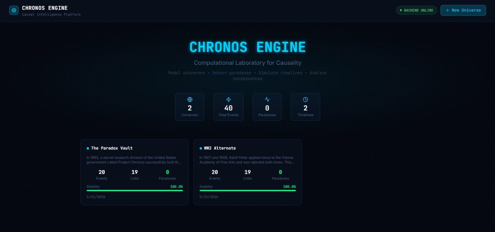
</div>

---

## CANVAS — CAUSAL GRAPH EDITOR

React Flow graph editor with drag, connect, and delete. Double-click canvas to add events, drag between nodes to create causal links, delete key to remove. Supports 5 node types: `origin` `terminal` `decision` `paradox` `standard`.

<div align="center">
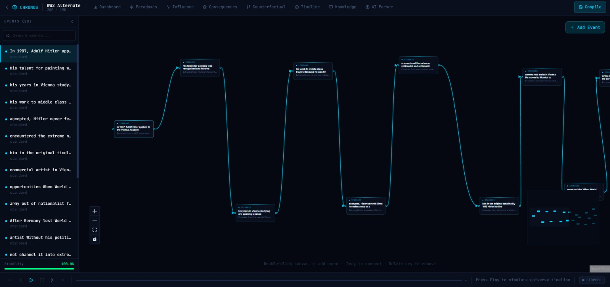
</div>

---

## UNIVERSE DASHBOARD

7-stage compilation pipeline: Parse → Validate → Detect Contradictions → Build Model → Simulate → Calculate Stability. Dashboard shows real-time health index, collapse risk, entropy, and density.

<div align="center">
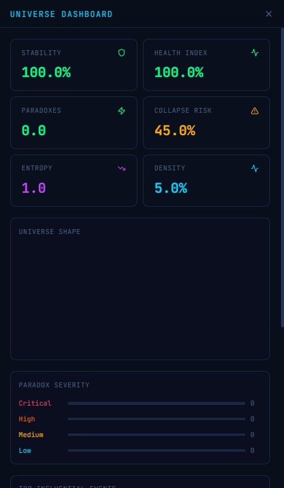
</div>

---

## PARADOX DETECTION

8 paradox types detected purely via graph algorithms. No LLM reasoning involved.

<div align="center">
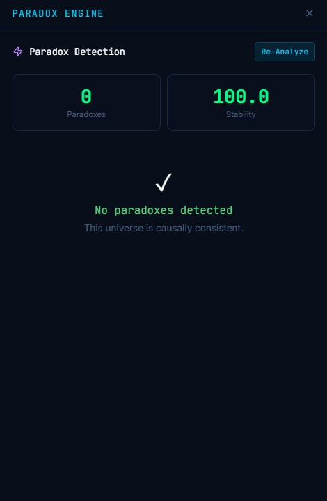
</div>

<br/>

| Paradox Type | Detection Method |
|---|---|
| Self-Causation | Self-loops in DiGraph |
| Grandfather | Cycles with destroy/kill/prevent labeled edges |
| Bootstrap | Cycles containing knowledge nodes with no external input |
| Infinite Loop | General simple cycle detection |
| Ontological | 2-node mutual dependency cycles |
| Information Void | Strongly connected components with no predecessors |
| Timeline Contradiction | Edge `u→v` where `timestamp(u) > timestamp(v)` |
| Recursive Reality | Long cycles of more than 6 nodes |

---

## CONSEQUENCE ENGINE

BFS cascade propagation 4 levels deep — immediate, secondary, tertiary, and long-term consequences. Click any event to see what it triggers downstream.

<div align="center">
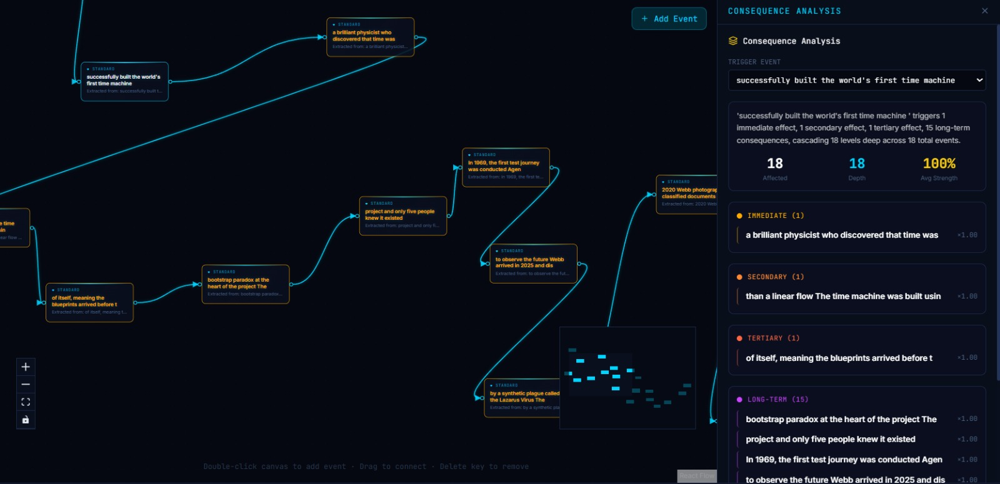
</div>

---

## COUNTERFACTUAL ENGINE

Full delta analysis on event removal: what's lost, what's preserved, stability shift, paradox delta. Animate the timeline collapse to visualize the impact.

<div align="center">
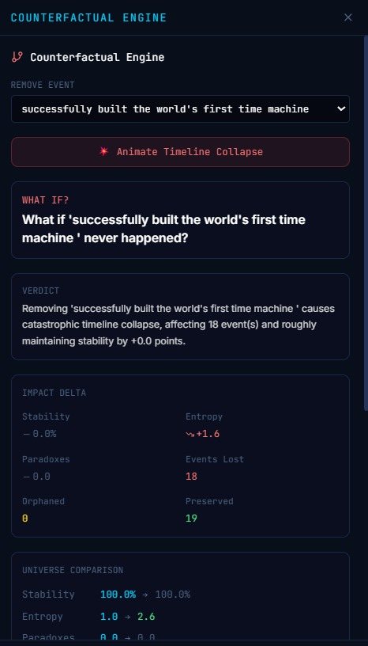
</div>

---

## INFLUENCE ANALYSIS

PageRank, Betweenness Centrality, Fragility Score, Danger Score — ranks every event by causal weight and identifies the most dangerous single point of failure.

<div align="center">
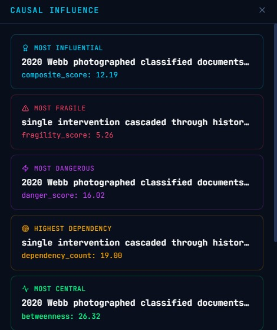
&nbsp;&nbsp;
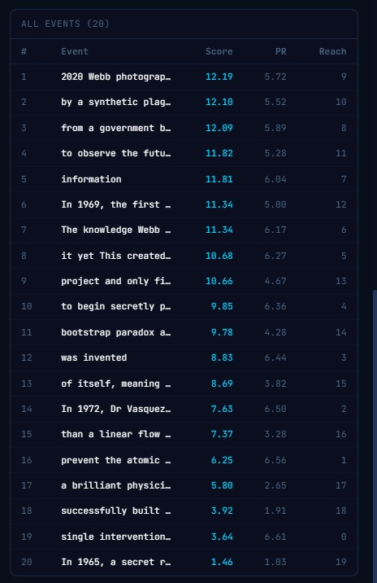
</div>

<br/>

| Metric | Algorithm | Purpose |
|---|---|---|
| Composite Score | Weighted combination | Overall event importance |
| PageRank | `nx.pagerank` | Influence via incoming links |
| Betweenness | `nx.betweenness_centrality` | Bridge / bottleneck events |
| Fragility Score | `in_degree x (1 - out/2)` | Cascade failure risk |
| Danger Score | `(PageRank + Betweenness) x 50` | Damage potential if removed |

---

## KNOWLEDGE ORIGIN TRACKER

Traces information flow through the graph. Detects bootstrap loops — knowledge that caused itself with no external origin.

<div align="center">
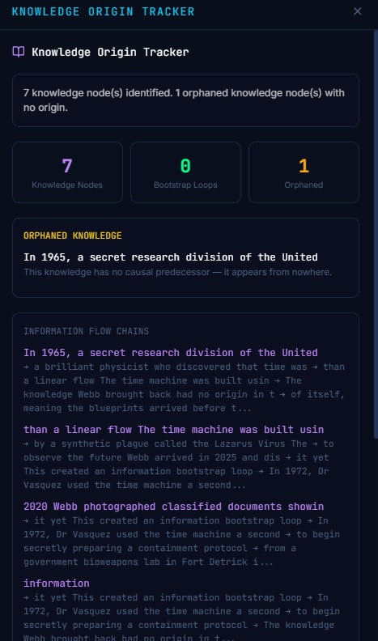
</div>

---

## AI STORY PARSER

Paste any narrative text. Ollama + `qwen2.5:14b` extracts events and causal relationships and builds the graph automatically. Regex fallback if Ollama is offline.

<div align="center">
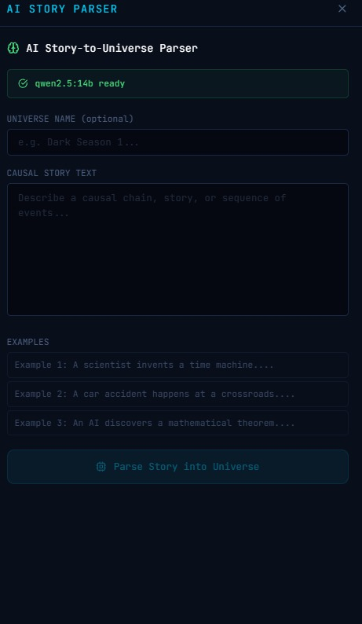
</div>

---

## EDIT EVENTS

Double-click any node to edit its label, description, type, and timestamp inline.

<div align="center">
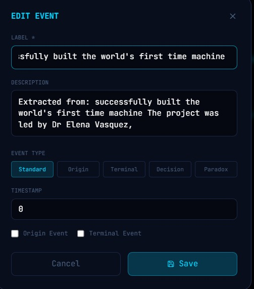
</div>

---

## QUICK START

**One Command — Windows**
```cmd
cd chronos-engine && start.bat
```

**Docker — Full Stack**
```bash
docker-compose up --build
```

<details>
<summary><b>Backend — Manual</b></summary>

```bash
cd backend
python -m venv venv
source venv/bin/activate        # Windows: venv\Scripts\activate
pip install -r requirements.txt
uvicorn main:app --reload --port 8000
```
</details>

<details>
<summary><b>Frontend — Manual</b></summary>

```bash
cd frontend
npm install
npm run dev
```
</details>

<details>
<summary><b>AI Parser — Optional</b></summary>

```bash
ollama pull qwen2.5:14b
ollama serve
```
</details>

---

## ARCHITECTURE

```
chronos-engine/
├── backend/
│   ├── main.py
│   └── app/
│       ├── api/
│       │   ├── universes.py             ← CRUD + compile + sync
│       │   ├── analysis.py              ← all analysis endpoints
│       │   ├── parser.py                ← AI story parser
│       │   ├── timeline.py              ← timeline simulator
│       │   └── multiverse.py            ← universe branching
│       ├── engines/
│       │   ├── paradox_engine.py        ← 8 paradox detectors
│       │   ├── consequence_engine.py    ← BFS cascade propagation
│       │   ├── influence_engine.py      ← PageRank + Betweenness
│       │   ├── timeline_engine.py       ← topological sort simulator
│       │   ├── causal_compiler.py       ← 7-stage compilation
│       │   ├── counterfactual_engine.py ← what-if analysis
│       │   └── multiverse_engine.py     ← branching + knowledge
│       ├── db/database.py
│       ├── schemas/universe.py
│       └── core/config.py
│
└── frontend/
    └── src/
        ├── app/
        │   ├── page.tsx                 ← universe selector home
        │   └── universe/[id]/           ← canvas workspace
        ├── components/
        │   ├── canvas/                  ← React Flow editor + nodes
        │   ├── layout/                  ← TopBar, Sidebar, Panels
        │   └── panels/                  ← all analysis panel UIs
        ├── store/index.ts               ← Zustand global state
        ├── utils/api.ts                 ← backend API client
        └── types/index.ts               ← TypeScript definitions
```

---

## TECH STACK

| Layer | Technology |
|---|---|
| Frontend | Next.js 15, React, TypeScript, Tailwind CSS |
| Graph Editor | React Flow (`@xyflow/react`) |
| Animations | Framer Motion |
| State | Zustand |
| Charts | Recharts |
| Backend | FastAPI, Python 3.11 |
| Graph Engine | NetworkX 3.3 |
| Database | SQLite (dev) / PostgreSQL (prod) |
| AI Parser | Ollama + `qwen2.5:14b` |
| Containers | Docker + Docker Compose |

---

## API REFERENCE

Full interactive docs at `http://localhost:8000/docs`

| Method | Endpoint | Description |
|---|---|---|
| `GET` | `/api/universes/` | List all universes |
| `POST` | `/api/universes/` | Create universe |
| `GET` | `/api/universes/{id}` | Get universe with events |
| `POST` | `/api/universes/{id}/compile` | Compile and analyze |
| `POST` | `/api/universes/{id}/sync` | Bulk sync from React Flow |
| `GET` | `/api/analysis/{id}/paradoxes` | Detect all paradoxes |
| `GET` | `/api/analysis/{id}/influence` | Full influence analysis |
| `GET` | `/api/analysis/{id}/consequences/{event_id}` | Consequence cascade |
| `GET` | `/api/analysis/{id}/counterfactual/{event_id}` | What-if analysis |
| `GET` | `/api/analysis/{id}/collapse/{event_id}` | Collapse simulation |
| `GET` | `/api/analysis/{id}/dashboard` | All metrics combined |
| `GET` | `/api/timeline/{id}/compile` | Compile timeline steps |
| `POST` | `/api/multiverse/{id}/branch` | Create universe branch |
| `POST` | `/api/parser/parse` | AI story-to-graph |
| `GET` | `/api/parser/status` | Ollama status check |

---

## CONFIGURATION

**`backend/.env`**
```env
DATABASE_URL=sqlite:///./chronos.db
OLLAMA_URL=http://localhost:11434
OLLAMA_MODEL=qwen2.5:14b
CORS_ORIGINS=["http://localhost:3000"]
```

**`frontend/.env.local`**
```env
NEXT_PUBLIC_API_URL=http://localhost:8000
```

---

## DESIGN PRINCIPLE

```
  Natural Language
        |
        v
  +--------------+
  |  Ollama LLM  |  <- only touches this part
  +--------------+
        |
        v  structured graph
  +------------------------------------------+
  |        Chronos Engine Algorithms         |
  |  paradox  consequence  influence         |
  |  counterfactual  timeline  multiverse    |
  +------------------------------------------+
        |
        v
  Deterministic · Reproducible · Transparent
```

Built to demonstrate that causal intelligence does not require a black box.

---

<div align="center">


</div>
